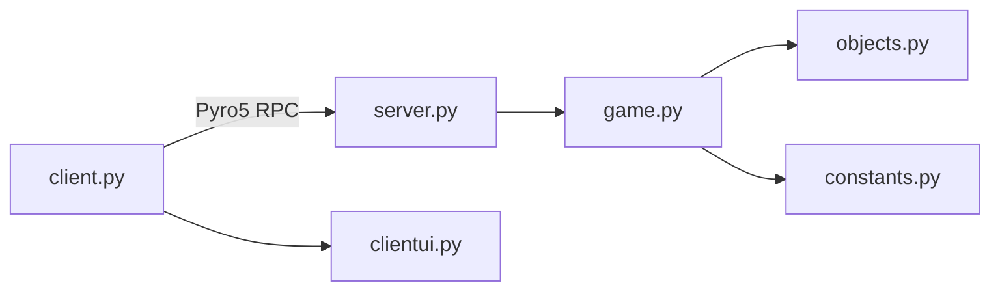

# RISK

Implementação em Python de uma versão do jogo de tabuleiro RISK, com arquitetura cliente-servidor e comunicação remota via Pyro5.

## Visão Geral

O projeto foi dividido para separar bem as responsabilidades:

- o servidor concentra as regras do jogo e o estado da partida;
- o cliente cuida da interface em terminal e das interações com o usuário;
- os módulos de domínio e constantes organizam os dados do mapa, jogadores, cartas e fases do jogo.

## Funcionalidades

- registro de jogadores;
- início automático da partida quando há jogadores suficientes;
- distribuição inicial de territórios;
- reforço de tropas por turno;
- ataque entre territórios vizinhos;
- manobra de tropas entre territórios aliados;
- troca de cartas;
- verificação de vitória;
- exibição de resumo do estado da partida para jogadores que aguardam sua vez.

## Arquitetura

O funcionamento principal segue este fluxo:



Para uma descrição mais detalhada dos módulos, veja a documentação em [docs/arquitetura-modulos.md](docs/arquitetura-modulos.md).

## Estrutura do Projeto

```text
README.md
code/
	constants.py
	game.py
	localtest.py
	main.py
	objects.py
	server/
		client.py
		clientui.py
		server.py
	tests/
		test_game.py
docs/
	arquitetura-modulos.md
pyro_tutorial/
	client_text.py
	README.md
	server_text.py
```

## Requisitos

- Python 3
- Pyro5

Se estiver usando ambiente virtual, ative-o antes de executar os comandos.

## Como Executar

### 1. Iniciar o servidor

Abra um terminal na pasta `code` e execute:

```powershell
py -m server.server
```

O servidor vai pedir a porta. Se você pressionar Enter, a porta padrão `9090` será usada.

### 2. Iniciar um cliente

Em outro terminal, também dentro da pasta `code`, execute:

```powershell
py -m server.client
```

O cliente vai pedir:

- IP do servidor;
- porta;
- apelido do jogador.

### 3. Jogar

Depois do cadastro, o cliente passa a consultar o estado da partida e mostra a interface de acordo com a fase atual:

- `waiting`
- `setup`
- `draft`
- `attack`
- `maneuver`
- `finished`

## Observações

- O servidor mantém o estado da partida e expõe as operações remotas.
- O cliente não decide as regras; ele apenas apresenta as opções e envia as ações.
- A interface de terminal foi separada em `clientui.py` para evitar duplicação de código.
- O resumo da partida e a última ação executada são compartilhados entre os clientes para melhorar a experiência de jogo.

## Documentação Complementar

- [Arquitetura dos módulos](docs/arquitetura-modulos.md)

## Licença

Este projeto foi desenvolvido para fins acadêmicos.
