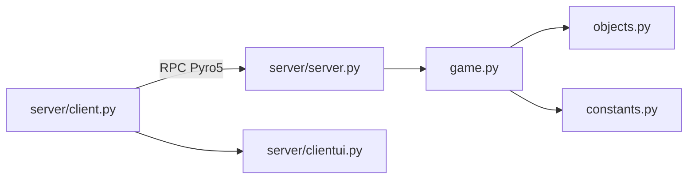
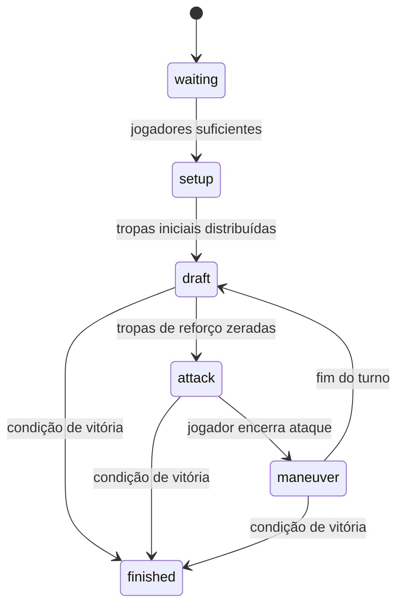
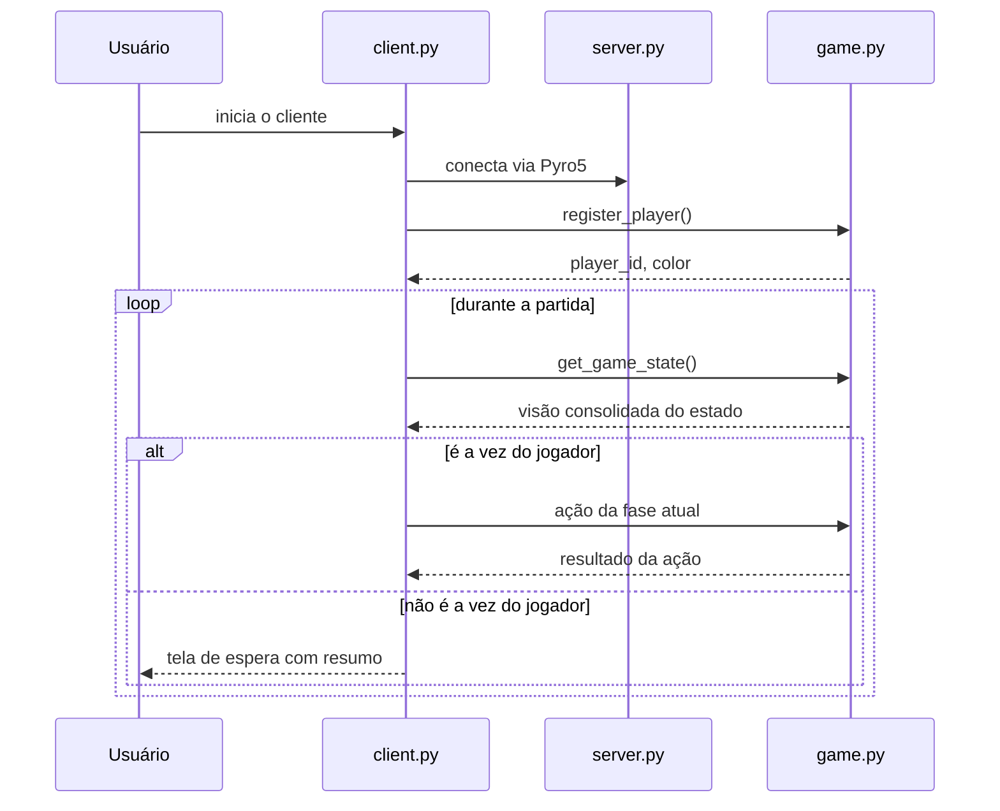

## Arquitetura dos Módulos

Este projeto implementa uma versão do jogo RISK em Python com arquitetura cliente-servidor e comunicação remota via Pyro5. O servidor mantém o estado autoritativo da partida e executa todas as regras de negócio. O cliente atua como camada de apresentação e coleta de entrada do usuário.

## Visão Geral



### Modelo de execução

- O cliente abre conexão com o servidor usando um URI Pyro5.
- O servidor expõe uma instância única do jogo e responde às chamadas remotas.
- O cliente não calcula regras localmente; ele apenas consulta o estado e envia comandos.
- O servidor gera a visão consolidada da partida para cada jogador.

## Estrutura de Diretórios

```text
README.md
code/
  constants.py
  game.py
  main.py
  objects.py
  server/
	client.py
	clientui.py
	server.py
docs/
  arquitetura-modulos.md
pyro_tutorial/
  client_text.py
  README.md
  server_text.py
```

## Responsabilidade de Cada Módulo

### `code/constants.py`

Centraliza parâmetros estáticos do domínio.

- `MAP`: define territórios, continentes, vizinhos e metadados de visualização.
- `CONTINENT_BONUS`: bônus de reforço por domínio completo de continente.
- `INITIAL_ARMIES`: tropas iniciais por quantidade de jogadores.
- `CARD_VALUES`: progressão de bônus ao trocar cartas.
- `GameState`: enum com o ciclo de vida da partida.

### `code/objects.py`

Concentra as entidades de domínio e tipos auxiliares.

- `CardSymbol`: enum dos símbolos possíveis das cartas.
- `Card`: representa uma carta do baralho do jogo.
- `Territory`: armazena estado de território, dono, tropas e vizinhos.
- `Player`: representa o participante da partida.
- `Dice`: utilitário simples para rolagem de dados.

### `code/game.py`

É o núcleo da aplicação. Contém o estado autoritativo e as regras do jogo.

#### Responsabilidades principais

- registrar jogadores;
- inicializar nova partida;
- distribuir territórios;
- calcular reforços por turno;
- validar e executar ataques;
- validar e executar manobras;
- processar troca de cartas;
- avançar fases e turnos;
- verificar condições de vitória;
- expor o estado para o cliente via RPC.

#### Estado mantido pelo objeto `Game`

- `players`: jogadores cadastrados.
- `territories`: mapa com o estado atual do tabuleiro.
- `turn_order`: ordem dos jogadores na partida.
- `current_turn_index`: posição do jogador ativo.
- `current_state`: fase atual da máquina de estados.
- `deck`: baralho de cartas disponível.
- `last_event`: última ação consolidada para consumo dos clientes.

#### Contrato de consulta para clientes

Os métodos de consulta montam uma visão derivada do estado interno:

- jogador ativo;
- nome do jogador ativo;
- territórios do jogador ativo;
- opções válidas de ataque;
- opções válidas de manobra;
- cartas do jogador ativo;
- resultado de vitória.

### `code/server/server.py`

Camada de infraestrutura de rede.

#### Responsabilidades

- configurar o daemon Pyro5;
- registrar o objeto remoto `risk.server`;
- manter o servidor em loop de requisições;
- fornecer entrada de porta no terminal.

#### Função no sistema

Esse módulo faz a ponte entre a rede e o objeto `Game`. Ele não implementa regra de negócio; apenas inicializa e expõe a instância da partida.

### `code/server/client.py`

Camada de apresentação e controle da interação.

#### Responsabilidades

- conectar ao servidor remoto;
- registrar o jogador;
- consumir `get_game_state()`;
- renderizar telas por fase;
- coletar ações do usuário;
- enviar comandos ao servidor;
- exibir resumo quando não for a vez do jogador.

#### Características do fluxo

- opera em polling, consultando o servidor periodicamente;
- mantém comportamento reativo à fase corrente;
- apresenta mensagens contextuais conforme a situação do turno;
- exibe o último evento compartilhado para sincronizar a percepção entre clientes.

### `code/server/clientui.py`

Camada de apoio de interface em terminal.

#### Responsabilidades

- limpar a tela;
- formatar territórios, cartas e cabeçalhos;
- exibir a tela de espera com resumo do jogador;
- encapsular prompts de entrada;
- reduzir duplicação de código no cliente.

## Máquina de Estados

O jogo opera como uma máquina de estados explícita por meio de `GameState`.



### Significado das fases

- `waiting`: aguardando jogadores suficientes.
- `setup`: distribuição inicial de tropas e territórios.
- `draft`: fase de reforço e troca de cartas.
- `attack`: fase de combate.
- `maneuver`: fase de movimentação interna.
- `finished`: partida encerrada.

## Comunicação Entre Componentes



## Modelo de Dados

O estado do jogo é composto principalmente por:

- `players`: mapeamento de jogadores por id.
- `territories`: mapeamento de territórios por nome.
- `turn_order`: sequência dos jogadores ativos.
- `current_state`: fase atual do jogo.
- `deck`: cartas disponíveis para distribuição.
- `trade_count`: contador de trocas realizadas.
- `conquered_this_turn`: indicador de conquista no turno atual.
- `last_event`: mensagem compartilhada para todos os clientes.

O servidor expõe também uma visão derivada para o cliente, contendo:

- `current_turn_id`;
- `current_turn_player_name`;
- `current_player_territories`;
- `current_player_attack_options`;
- `current_player_maneuver_options`;
- `current_player_cards`;
- `victory`.

## Fluxo de Execução

### Inicialização do servidor

1. O usuário executa `python -m server.server` a partir da pasta `code/`.
2. `server.py` cria o daemon Pyro5.
3. A instância de `Game` é registrada com o nome `risk.server`.
4. O servidor permanece em loop aguardando chamadas remotas.

### Inicialização do cliente

1. O usuário executa `python -m server.client`.
2. O cliente coleta IP, porta e apelido.
3. O jogador é registrado no servidor.
4. O loop principal consulta o estado da partida.
5. Se o jogador estiver ativo, a interface solicita a ação correspondente à fase.
6. Se o jogador não estiver ativo, o cliente mostra o resumo de espera e aguarda atualização.

## Observações de Projeto

- O servidor é a fonte única de verdade da partida.
- As regras não são replicadas no cliente; isso evita divergências entre sessões.
- `clientui.py` existe para manter a interface em terminal isolada do controle de fluxo.
- O estado compartilhado entre clientes foi pensado para melhorar a experiência de observação enquanto se aguarda a vez.
- A comunicação remota usa Pyro5 para desacoplar a interface local da lógica central do jogo.

## Como Executar

### Servidor

```powershell
cd code
py -m server.server
```

### Cliente

```powershell
cd code
py -m server.client
```

## Resumo

A arquitetura separa claramente três responsabilidades:

- domínio e regras em `game.py`;
- rede e exposição remota em `server.py`;
- interação com usuário em `client.py` e `clientui.py`.

Essa divisão deixa o sistema mais fácil de manter, evoluir e depurar, sem misturar interface com regras de negócio.